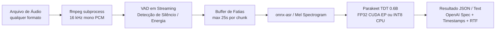

# Parakeet TDT 0.6B v3 pt-BR (ONNX) — TAGARELA

Servidor de Speech-to-Text (STT) de produção para **Português Brasileiro (pt-BR)** baseado no modelo **NVIDIA Parakeet TDT 0.6B v3** (fine-tune TAGARELA). Dois checkpoints ONNX estão disponíveis; **na GPU use FP32**.

| `USE_QUANTIZATION` | Checkpoint | Para quê | Tamanho |
| :--- | :--- | :--- | :--- |
| **`false` (GPU)** | FP32 [alefiury/...-TAGARELA-onnx](https://huggingface.co/alefiury/parakeet-tdt-0.6b-v3-ptBR-TAGARELA-onnx) | Servidor com NVIDIA GPU. MatMul no CUDA EP (cuBLAS). | ~2.5 GB |
| **`true` (CPU)** | INT8 [calneymgp/...-onnx-int8](https://huggingface.co/calneymgp/parakeet-tdt-0.6b-v3-ptBR-TAGARELA-onnx-int8) | CPU, ou quando o objetivo é só reduzir disco/VRAM. **Não é INT8 de Tensor Core.** | ~0.9 GB |

O `.env.example` recomenda `false` (GPU). Sem `.env`, o Compose ainda cai em `true` (artefato menor). Mudar `USE_QUANTIZATION` **não** exige rebuild: o volume `./models/parakeet` recebe o checkpoint no primeiro start (ou quando o encoder da variante ainda não está lá).

Detalhes: [INT8 é para CPU; FP32 é para GPU](#int8-é-para-cpu-fp32-é-para-gpu).

---

## Destaques do Projeto

- **ONNX Runtime (CUDA Execution Provider)**: inferência sem PyTorch ou NeMo em runtime. Na GPU o caminho rápido é o **FP32**.
- **Idle VRAM**: após `SLEEP_IDLE_SECONDS` sem requests, as sessões ORT são destruídas e a GPU sofre `cudaDeviceReset`, devolvendo a VRAM ao driver (mesmo padrão do `llama-server --sleep-idle-seconds`).
- **Streaming VAD (Voice Activity Detection)**: decodificação contínua via `ffmpeg` fatiada dinamicamente por energia acústica. Processa áudios de qualquer formato e de **duração ilimitada sem estourar RAM ou VRAM**.
- **Compatível com OpenAI API**: endpoint `/v1/audio/transcriptions`, bibliotecas existentes e SDK oficial da OpenAI.
- **Modelo no host**: Compose bind-monta `MODEL_HOST_DIR` (padrão `./models/parakeet`) em `MODEL_DIR` (`/opt/models/parakeet`). Rebuild e restart reutilizam os pesos. Air-gap: pré-popular essa pasta e subir sem rede.
- **Imagem Docker sem pesos**: parte de `nvidia/cuda:12.4.1-base` e copia só as libs que o ONNX Runtime CUDA EP realmente liga (`ldd`). Fora da imagem: **NPP, NCCL, cuSOLVER, cuSPARSE, nvJPEG e cuFile**. Permanecem cuBLAS, cuFFT, cuRAND, NVRTC e cuDNN 9.

---

## Arquitetura de Execução



### Por que esta combinação técnica?

| Escolha | Motivo técnico |
| :--- | :--- |
| **FP32 + `onnxruntime-gpu` (CUDA EP)** | Na GPU, `MatMul` FP32 usa cuBLAS. É o caminho de throughput. INT8 dinâmico **não** acelera este servidor (ver seção abaixo). |
| **CUDA slim (`*-base` + cópia seletiva)** | A imagem `cudnn-runtime` inteira traz NPP/NCCL/cuSOLVER/cuSPARSE (~1 GB+) inúteis para este servidor. O Dockerfile copia só cuBLAS, cuFFT, cuRAND, NVRTC e cuDNN. Os pesos ONNX ficam no bind-mount do host, não na imagem. |
| **Preprocessor** | `PREPROCESS_ON_GPU=1` (padrão): Mel/STFT no CUDA. `0` = NumPy no CPU. |
| **`gpu_mem_limit`** | Teto do arena CUDA enquanto o modelo está acordado (padrão 6 GB; FP32 pode precisar de 8 GB). Não reserva os 24 GB da 3090. |
| **`SLEEP_IDLE_SECONDS` (default 60)** | Sem tráfego, unload + `cudaDeviceReset`. A próxima request recarrega o modelo (warmup ~1–3 s). |
| **`ffmpeg` → PCM 16 kHz mono pipe** | Suporta qualquer container/codec: MP3, MP4, M4A, AAC, OGG, OPUS, FLAC, WEBM, MKV, WAV, etc. |
| **VAD em streaming** | Duração de áudio ilimitada; o uso de RAM é proporcional a 1 chunk (~30 s) e não ao tamanho total do arquivo. |
| **1 worker Uvicorn + Semaphore Lock** | A sessão ORT/CUDA não é segura para múltiplos processos bifurcados (fork-unsafe). A fila em semáforo serializa requisições sem contenção de contexto CUDA. |

---

## INT8 é para CPU; FP32 é para GPU

`USE_QUANTIZATION` **não** significa “INT8 mais rápido na GPU”. Significa “qual checkpoint o entrypoint baixa para o volume”.

### `USE_QUANTIZATION=false` — use isto na GPU

Carrega o ONNX **FP32**. Os `MatMul` do FastConformer ficam no **CUDA Execution Provider** (cuBLAS). É o modo em que uma 3090 / 5060 realmente trabalha. Ocupa mais disco e VRAM (~2.5 GB de pesos; `GPU_MEM_LIMIT_GB=8` se houver OOM).

No `.env`:

```
USE_QUANTIZATION=false
GPU_MEM_LIMIT_GB=8
```

Depois reinicie (o entrypoint baixa o FP32 para `./models/parakeet` se o encoder ainda não estiver lá):

```bash
docker compose up -d
```

### `USE_QUANTIZATION=true` — INT8 desenhado para CPU

Carrega o INT8 **dinâmico** (`onnxruntime.quantization.quantize_dynamic`, só `MatMul`, `QInt8`). Esse export foi feito para **CPU** (menos RAM/disco em apps desktop). **Não** é quantização estática com calibração, nem INT8 de Tensor Core / TensorRT.

O que o grafo faz: cada `MatMul` vira `DynamicQuantizeLinear` (ativações em **UINT8**) + `MatMulInteger`. O CUDA EP do ONNX Runtime **não executa bem esse `MatMulInteger` UINT8** — os nós caem no **CPUExecutionProvider**. Conv e LayerNorm podem continuar na GPU. Resultado: o encoder (e cada passo do decoder TDT) pinga **GPU → CPU → GPU** em quase todas as camadas.

Consequências observadas neste servidor:

- INT8 na GPU costuma ser **várias vezes mais lento** que FP32 (na ordem de **~4×** neste stack), não mais rápido.
- Trocar de GPU (1050 Ti vs 3090 vs 5060) **quase não muda** o tempo com INT8: o trabalho pesado está no CPU + cópias, não nos SMs.
- INT8 **é** adequado se você rodar sem CUDA, ou se o único objetivo for o arquivo de ~0.9 GB.

INT8 de GPU que *seria* mais rápido exigiria outro export (QDQ estático + TensorRT, ou weight-only `MatMulNBits` com kernel CUDA). Este checkpoint não é isso. **Não use TensorRT** neste INT8 dinâmico.

O decoder TDT do `onnx-asr` continua um loop greedy no host (`session.run` por frame do encoder) nos dois modos. Por isso o FP32 ainda pode não escalar com a classe da GPU como um Whisper em CTranslate2 — mas deixa de estar preso ao CPU no `MatMulInteger`.

---

## Estrutura do Repositório

```
parakeet-tdt-0.6b-v3-ptBR-tagarela-onnx-int8/
├── Dockerfile             # CUDA slim + Python; pesos NÃO entram na imagem
├── compose.yaml           # GPU, tmpfs, bind-mount ./models/parakeet
├── entrypoint.sh          # chown do volume + download se o encoder faltar
├── requirements.txt       # Dependências Python (onnx-asr, onnxruntime-gpu, FastAPI)
├── app.py                 # Servidor FastAPI com VAD streaming e motor ASR
├── .dockerignore          # Filtro de contexto para build do Docker
├── .gitignore             # Arquivos e pastas ignorados pelo Git
├── .env.example           # Modelo de variáveis de ambiente configuráveis
├── download_model.py      # Download Hugging Face (host ou first-boot do container)
├── client_example.py      # Cliente CLI de teste (Python padrão sem dependências)
└── README.md              # Documentação completa do projeto
```

---

## Requisitos do Host

- **Driver NVIDIA**: Versão recente (≥ 550 recomendado).
- **NVIDIA Container Toolkit**: [Guia de Instalação Oficial](https://docs.nvidia.com/datacenter/cloud-native/container-toolkit/install-guide.html).
- **Docker** e **Docker Compose**.

---

## Inicialização Rápida com Docker Compose

### 1. Construir e Iniciar o Contêiner

```bash
cp .env.example .env
# Defina API_KEY em .env antes de expor a porta publicamente.
# GPU (recomendado): USE_QUANTIZATION=false  → FP32 (~2.5 GB)
# CPU / tamanho:     USE_QUANTIZATION=true   → INT8 dinâmico (~0.9 GB), lento na GPU
# Pesos em ./models/parakeet (bind-mount). Rebuild não baixa de novo.
docker compose up -d --build
```

Na **primeira** subida o entrypoint baixa o checkpoint para `./models/parakeet` se o encoder não existir. Restarts e rebuilds reutilizam essa pasta. A imagem (`parakeet-stt-ptbr:1.0.0`) não inclui os pesos; o estágio final usa `nvidia/cuda:12.4.1-base-ubuntu22.04` e recebe só cuBLAS, cuBLASLt, cuFFT, cuRAND, NVRTC e cuDNN 9. Pacotes da imagem `cudnn-runtime` **não copiados** (o CUDA EP do ORT não liga esses `.so`):

- **NPP** — primitivas de imagem/vídeo
- **NCCL** — comunicação multi-GPU
- **cuSOLVER** / **cuSPARSE** — álgebra densa/esparsa de solver
- **nvJPEG** / **cuFile** — JPEG na GPU e GPUDirect Storage

### 2. Verificar Prontidão

```bash
# Liveness
curl -s http://localhost:8080/health

# Readiness (modelo pode estar unloaded após idle sleep)
curl -s http://localhost:8080/ready
```

Resposta esperada:
```json
{"status":"ready","model_loaded":true,"sleep_idle_seconds":60,"providers":["CUDAExecutionProvider","CPUExecutionProvider"],"vram_used_mb":2100.0}
```

---

## Exemplos de Uso da API

### Usando cURL

#### Formato Detalhado (`verbose_json`) com Timestamps e Real-Time Factor (RTF):

```bash
curl -sS -X POST http://localhost:8080/v1/audio/transcriptions \
  -H "Authorization: Bearer $API_KEY" \
  -F file=@audio_exemplo.m4a \
  -F response_format=verbose_json
```

Exemplo de resposta:
```json
{
  "text": "olá tudo bem este é um teste de transcrição em português com parakeet",
  "language": null,
  "duration": 4.52,
  "processing_time": 0.12,
  "realtime_factor": 0.0265,
  "segments": [
    {
      "id": 0,
      "start": 0.0,
      "end": 4.52,
      "text": "olá tudo bem este é um teste de transcrição em português com parakeet"
    }
  ],
  "model": "parakeet-tdt-0.6b-v3-ptBR-TAGARELA-onnx-int8"
}
```

#### Formato Simples (`json`):

```bash
curl -sS -X POST http://localhost:8080/v1/audio/transcriptions \
  -H "Authorization: Bearer $API_KEY" \
  -F file=@audio_exemplo.mp3 \
  -F response_format=json
```

Resposta:
```json
{
  "text": "olá tudo bem este é um teste de transcrição em português com parakeet",
  "duration": 4.52
}
```

#### Formato Texto Puro (`text`):

```bash
curl -sS -X POST http://localhost:8080/v1/audio/transcriptions \
  -H "Authorization: Bearer $API_KEY" \
  -F file=@audio_exemplo.wav \
  -F response_format=text
```

---

### Usando o Script Cliente Incluso (`client_example.py`)

O repositório inclui um cliente CLI pronto para uso, implementado apenas com a biblioteca padrão do Python (`urllib`):

```bash
python3 client_example.py caminho/para/audio.mp3 --format verbose_json --api-key "$API_KEY"
```

---

### Usando o SDK Oficial da OpenAI (Python)

Como o endpoint implementa o contrato `/v1/audio/transcriptions`, você pode utilizá-lo como substituto direto do Whisper no SDK oficial:

```python
import os
from openai import OpenAI

client = OpenAI(
    base_url="http://localhost:8080/v1",
    api_key=os.environ["API_KEY"],
)

with open("audio.m4a", "rb") as audio_file:
    transcription = client.audio.transcriptions.create(
        model="parakeet-tdt-0.6b-v3-ptBR",
        file=audio_file,
        response_format="verbose_json",
    )

print("Texto transcrito:", transcription.text)
```

---

## Endpoints Disponíveis

| Método | Endpoint | Descrição |
| :--- | :--- | :--- |
| `POST` | `/v1/audio/transcriptions` | Endpoint principal de transcrição (compatível OpenAI). Exige `API_KEY` quando definida. |
| `POST` | `/transcribe` | Alias conveniente para transcrição (mesma autenticação). |
| `GET` | `/health` | Checagem de integridade (liveness probe). |
| `GET` | `/ready` | Checagem de disponibilidade do modelo e providers ORT. |
| `GET` | `/v1/models` | Lista de modelos disponíveis (compatível OpenAI). |

---

## Variáveis de Ambiente

O `.env` (cópia de `.env.example`) só tem o que muda por máquina ou é segredo. Internos (`MODEL_DIR`, `MODEL_ARCH`, chunking, threads, flags CUDA/ORT) ficam na imagem / `compose.yaml`.

| Variável | Padrão | Descrição |
| :--- | :--- | :--- |
| `API_KEY` | *(vazio)* | Se definido, `/v1/audio/transcriptions` e `/transcribe` exigem `Authorization: Bearer …` ou `X-API-Key`. `/health` e `/ready` permanecem abertos. |
| `HF_TOKEN` | *(vazio)* | Token do Hub no **primeiro** download (ou se o encoder faltar). |
| `USE_QUANTIZATION` | `true` sem `.env` | **`false` = FP32 para GPU**. **`true` = INT8 dinâmico para CPU**. Após mudar: `docker compose up -d`. |
| `MODEL_HOST_DIR` | `./models/parakeet` | Pasta no **host** bind-montada em `/opt/models/parakeet`. |
| `GPU_ID` | `0` | Índice da GPU no host (`nvidia-smi`). Um único ID. |
| `GPU_MEM_LIMIT_GB` | `6` na imagem; `8` no `.env.example` | Teto de VRAM do arena CUDA (GB). FP32 costuma precisar de 8. |
| `SLEEP_IDLE_SECONDS` | `60` | Segundos sem request até unload da GPU. `0` desliga o sleep. |
| `PORT` | `8080` | Porta HTTP (host e contêiner). |

---

## Dicas de Desempenho e Ajustes

- **GPU**: `USE_QUANTIZATION=false` (FP32) e `docker compose up -d`. INT8 neste repo **não** acelera a GPU.
- **Throughput com o modelo quente**: `SLEEP_IDLE_SECONDS=0`, `MAX_CHUNK_S=30`, `PREPROCESS_ON_GPU=1`. `40` só se VRAM/qualidade aguentar.
- **VRAM mínima quando ocioso**: `SLEEP_IDLE_SECONDS=60` (padrão). A 3090 fica livre para LLM/TTS até a próxima transcrição.
- **Primeira request após o sleep**: recarrega o modelo + warmup curto (cuDNN `HEURISTIC`, não `EXHAUSTIVE`). Não use essa request para benchmark.
- **TensorRT**: não use TRT neste INT8 dinâmico (MatMul-only, sem calibração, `MatMulInteger` UINT8). CUDA EP + FP32 é o caminho suportado na GPU.
- **Tamanho da imagem**: os pesos ficam no bind-mount, não na imagem. Não volte para `nvidia/cuda:*-cudnn-runtime` como estágio final — isso reintroduz NPP, NCCL, cuSOLVER e cuSPARSE sem ganho de transcrição.

---

## Execução Local fora do Docker (Opcional)

Caso prefira rodar diretamente no host Linux com ambiente virtual Python:

1. **Instale as dependências do sistema**:
   ```bash
   sudo apt-get update && sudo apt-get install -y ffmpeg
   ```

2. **Crie o ambiente virtual e instale os pacotes**:
   ```bash
   python3 -m venv .venv
   source .venv/bin/activate
   pip install -r requirements.txt
   pip uninstall -y onnxruntime || true
   pip install --force-reinstall --no-deps "onnxruntime-gpu>=1.22.0,<1.27.0"
   ```

3. **Baixe o modelo**:
   ```bash
   # GPU (recomendado): FP32
   USE_QUANTIZATION=false python3 download_model.py --dest ./models/parakeet

   # CPU / tamanho: INT8 dinâmico (lento no CUDA EP)
   USE_QUANTIZATION=true python3 download_model.py --dest ./models/parakeet
   ```

4. **Inicie o servidor**:
   ```bash
   export MODEL_DIR="./models/parakeet"
   export USE_QUANTIZATION=false   # deve coincidir com o download
   uvicorn app:app --host 0.0.0.0 --port 8080
   ```

---

## Créditos e Reconhecimentos

- Modelo desenvolvido e treinado pela [NVIDIA NeMo (Parakeet TDT 0.6B)](https://huggingface.co/nvidia/parakeet-tdt-0.6b-v3).
- Fine-tune pt-BR TAGARELA e export ONNX: [alefiury/parakeet-tdt-0.6b-v3-ptBR-TAGARELA-onnx](https://huggingface.co/alefiury/parakeet-tdt-0.6b-v3-ptBR-TAGARELA-onnx).
- Quantização INT8: [TAGARELA / Calney G. P. Silva](https://huggingface.co/calneymgp/parakeet-tdt-0.6b-v3-ptBR-TAGARELA-onnx-int8).
- Motor de inferência leve por [onnx-asr](https://github.com/thewh1teagle/onnx-asr) e [ONNX Runtime](https://onnxruntime.ai/).
