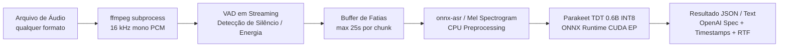

# Parakeet TDT 0.6B v3 pt-BR (ONNX INT8) — TAGARELA

Servidor de Speech-to-Text (STT) de alta performance e produção para **Português Brasileiro (pt-BR)** baseado no modelo **NVIDIA Parakeet TDT 0.6B v3** (fine-tune TAGARELA). Por padrão usa a quantização **ONNX INT8** ([calneymgp](https://huggingface.co/calneymgp/parakeet-tdt-0.6b-v3-ptBR-TAGARELA-onnx-int8)); `USE_QUANTIZATION=false` baixa o ONNX de precisão total ([alefiury](https://huggingface.co/alefiury/parakeet-tdt-0.6b-v3-ptBR-TAGARELA-onnx)).

---

## Destaques do Projeto

- **Ultraleve e Rápido**: Executa com **ONNX Runtime (CUDA Execution Provider)** sem dependências pesadas de PyTorch ou NeMo em tempo de inferência.
- **Pegada de VRAM Reduzida**: INT8 + `gpu_mem_limit` de 4 GB enquanto o modelo está carregado. Após `SLEEP_IDLE_SECONDS` sem requests, as sessões ORT são destruídas e a GPU sofre `cudaDeviceReset`, devolvendo a VRAM ao driver (mesmo padrão do `llama-server --sleep-idle-seconds`).
- **Streaming VAD (Voice Activity Detection)**: Decodificação contínua via `ffmpeg` fatiada dinamicamente por energia acústica. Processa áudios de qualquer formato e de **duração ilimitada sem estourar RAM ou VRAM**.
- **Compatível com OpenAI API**: Endpoint compatível com `/v1/audio/transcriptions`, permitindo integração direta com bibliotecas existentes e com o SDK oficial da OpenAI.
- **Air-Gap / Self-Contained**: O modelo ONNX escolhido (`USE_QUANTIZATION`) é baixado e congelado dentro da imagem Docker na etapa de build, garantindo inicialização confiável e sem dependência externa em runtime.
- **Imagem Docker ~4.3 GB**: parte de `nvidia/cuda:12.4.1-base` e copia só as libs que o ONNX Runtime CUDA EP realmente liga (`ldd`). Fora da imagem: **NPP, NCCL, cuSOLVER, cuSPARSE, nvJPEG e cuFile** (não usadas neste STT de GPU única). Permanecem cuBLAS, cuFFT, cuRAND, NVRTC e cuDNN 9.

---

## Arquitetura de Execução



### Por que esta combinação técnica?

| Escolha | Motivo técnico |
| :--- | :--- |
| **ONNX INT8 + `onnxruntime-gpu` (CUDA EP)** | Menor uso de VRAM e maior throughput; elimina overhead de PyTorch e NeMo em produção. |
| **CUDA slim (`*-base` + cópia seletiva)** | A imagem `cudnn-runtime` inteira traz NPP/NCCL/cuSOLVER/cuSPARSE (~1 GB+) inúteis para este servidor. O Dockerfile copia só cuBLAS, cuFFT, cuRAND, NVRTC e cuDNN. Imagem final **~4.3 GB** (`docker images`). |
| **Preprocessor no CPU (NumPy)** | Mel spectrogram fora da GPU; VRAM só para encoder/decoder TDT INT8. |
| **`gpu_mem_limit` 4 GB** | Teto do arena CUDA enquanto o modelo está acordado; não reserva os 24 GB da 3090. |
| **`SLEEP_IDLE_SECONDS` (default 60)** | Sem tráfego, unload + `cudaDeviceReset`. A próxima request recarrega o INT8 (warmup ~1–3 s). |
| **`ffmpeg` → PCM 16 kHz mono pipe** | Suporta qualquer container/codec: MP3, MP4, M4A, AAC, OGG, OPUS, FLAC, WEBM, MKV, WAV, etc. |
| **VAD em streaming** | Duração de áudio ilimitada; o uso de RAM é proporcional a 1 chunk (~25s) e não ao tamanho total do arquivo. |
| **1 worker Uvicorn + Semaphore Lock** | A sessão ORT/CUDA não é segura para múltiplos processos bifurcados (fork-unsafe). Como a inferência ocorre a dezenas de vezes a velocidade de tempo-real, a fila em semáforo serializa requisições sem contenção de contexto CUDA. |

---

## Estrutura do Repositório

```
parakeet-tdt-0.6b-v3-ptBR-tagarela-onnx-int8/
├── Dockerfile             # Imagem ~4.3 GB: CUDA base + libs ORT; sem NPP/NCCL/cuSOLVER/cuSPARSE
├── compose.yaml           # Orquestração Docker Compose com reservas de GPU e tmpfs
├── requirements.txt       # Dependências Python (onnx-asr, onnxruntime-gpu, FastAPI)
├── app.py                 # Servidor FastAPI com VAD streaming e motor ASR
├── .dockerignore          # Filtro de contexto para build do Docker
├── .gitignore             # Arquivos e pastas ignorados pelo Git
├── .env.example           # Modelo de variáveis de ambiente configuráveis
├── download_model.py      # Script utilitário para download local do modelo
├── client_example.py      # Cliente CLI de teste (Python padrão sem dependências)
└── README.md              # Documentação completa do projeto
```

---

## Requisitos do Host

- **Driver NVIDIA**: Versão recente (≥ 550 recomendado).
- **NVIDIA Container Toolkit**: [Guia de Instalação Oficial](https://docs.nvidia.com/datacenter/cloud-native/container-toolkit/install-guide.html).
- **Docker** e **Docker Compose**.

---

## Inicialização Rápida com Docker Compose

### 1. Construir e Iniciar o Contêiner

```bash
cp .env.example .env
# Defina API_KEY em .env antes de expor a porta publicamente.
# USE_QUANTIZATION=true  → INT8 (~0.9 GB)
# USE_QUANTIZATION=false → FP32 alefiury (~2.5 GB); exige rebuild
docker compose up -d --build
```

O download do modelo ocorre durante o build da imagem Docker. A imagem resultante (`parakeet-stt-ptbr:1.0.0`) fica em torno de **4.3 GB** no `docker images`: o estágio final usa `nvidia/cuda:12.4.1-base-ubuntu22.04` e recebe só cuBLAS, cuBLASLt, cuFFT, cuRAND, NVRTC e cuDNN 9. Pacotes da imagem `cudnn-runtime` **não copiados** (o CUDA EP do ORT não liga esses `.so`):

- **NPP** — primitivas de imagem/vídeo
- **NCCL** — comunicação multi-GPU
- **cuSOLVER** / **cuSPARSE** — álgebra densa/esparsa de solver
- **nvJPEG** / **cuFile** — JPEG na GPU e GPUDirect Storage

### 2. Verificar Prontidão

```bash
# Liveness
curl -s http://localhost:8080/health

# Readiness (modelo pode estar unloaded após idle sleep)
curl -s http://localhost:8080/ready
```

Resposta esperada:
```json
{"status":"ready","model_loaded":true,"sleep_idle_seconds":60,"providers":["CUDAExecutionProvider","CPUExecutionProvider"],"vram_used_mb":2100.0}
```

---

## Exemplos de Uso da API

### Usando cURL

#### Formato Detalhado (`verbose_json`) com Timestamps e Real-Time Factor (RTF):

```bash
curl -sS -X POST http://localhost:8080/v1/audio/transcriptions \
  -H "Authorization: Bearer $API_KEY" \
  -F file=@audio_exemplo.m4a \
  -F response_format=verbose_json
```

Exemplo de resposta:
```json
{
  "text": "olá tudo bem este é um teste de transcrição em português com parakeet",
  "language": "pt-BR",
  "duration": 4.52,
  "processing_time": 0.12,
  "realtime_factor": 0.0265,
  "segments": [
    {
      "id": 0,
      "start": 0.0,
      "end": 4.52,
      "text": "olá tudo bem este é um teste de transcrição em português com parakeet"
    }
  ],
  "model": "parakeet-tdt-0.6b-v3-ptBR-TAGARELA-onnx-int8"
}
```

#### Formato Simples (`json`):

```bash
curl -sS -X POST http://localhost:8080/v1/audio/transcriptions \
  -H "Authorization: Bearer $API_KEY" \
  -F file=@audio_exemplo.mp3 \
  -F response_format=json
```

Resposta:
```json
{
  "text": "olá tudo bem este é um teste de transcrição em português com parakeet",
  "duration": 4.52
}
```

#### Formato Texto Puro (`text`):

```bash
curl -sS -X POST http://localhost:8080/v1/audio/transcriptions \
  -H "Authorization: Bearer $API_KEY" \
  -F file=@audio_exemplo.wav \
  -F response_format=text
```

---

### Usando o Script Cliente Incluso (`client_example.py`)

O repositório inclui um cliente CLI pronto para uso, implementado apenas com a biblioteca padrão do Python (`urllib`):

```bash
python3 client_example.py caminho/para/audio.mp3 --format verbose_json --api-key "$API_KEY"
```

---

### Usando o SDK Oficial da OpenAI (Python)

Como o endpoint implementa o contrato `/v1/audio/transcriptions`, você pode utilizá-lo como substituto direto do Whisper no SDK oficial:

```python
import os
from openai import OpenAI

client = OpenAI(
    base_url="http://localhost:8080/v1",
    api_key=os.environ["API_KEY"],
)

with open("audio.m4a", "rb") as audio_file:
    transcription = client.audio.transcriptions.create(
        model="parakeet-tdt-0.6b-v3-ptBR",
        file=audio_file,
        response_format="verbose_json",
    )

print("Texto transcrito:", transcription.text)
```

---

## Endpoints Disponíveis

| Método | Endpoint | Descrição |
| :--- | :--- | :--- |
| `POST` | `/v1/audio/transcriptions` | Endpoint principal de transcrição (compatível OpenAI). Exige `API_KEY` quando definida. |
| `POST` | `/transcribe` | Alias conveniente para transcrição (mesma autenticação). |
| `GET` | `/health` | Checagem de integridade (liveness probe). |
| `GET` | `/ready` | Checagem de disponibilidade do modelo e providers ORT. |
| `GET` | `/v1/models` | Lista de modelos disponíveis (compatível OpenAI). |

---

## Variáveis de Ambiente

As seguintes variáveis podem ser configuradas no arquivo `.env` ou diretamente no `compose.yaml`:

| Variável | Padrão | Descrição |
| :--- | :--- | :--- |
| `MODEL_DIR` | `/opt/models/parakeet` | Diretório onde os artefatos do modelo ONNX residem. |
| `MODEL_ARCH` | `nemo-conformer-tdt` | Tipo ONNX-ASR deste checkpoint (`config.json`). |
| `USE_QUANTIZATION` | `true` | `true` = INT8 (`calneymgp/...-onnx-int8`). `false` = FP32 (`alefiury/...-TAGARELA-onnx`). Rebuild após mudar: `docker compose up -d --build`. |
| `MODEL_ID` | *(derivado)* | Nome do modelo na API. Vazio = ID do repositório Hugging Face escolhido. |
| `LANGUAGE` | `pt-BR` | Código de idioma retornado nos metadados. |
| `GPU_ID` | `0` | Índice da GPU no host (`nvidia-smi`). O Compose faz o pin via `device_ids`; no contêiner o ORT sempre usa o dispositivo CUDA `0`. Um único ID — `0,1` não vira lista YAML. |
| `GPU_MEM_LIMIT_GB` | `6` | Teto de VRAM do arena CUDA enquanto o modelo está carregado (GB). |
| `MAX_CHUNK_S` | `30` | Janela do encoder (s). 30 s ocupa melhor a 3090 que 20 s; o decoder TDT continua O(T). |
| `CHUNK_OVERLAP_S` | `1.0` | Sobreposição só para corte duro (silêncio não precisa de 2 s). |
| `PREPROCESS_ON_GPU` | `1` | Mel/STFT conv no CUDA. `0` = NumPy no CPU. |
| `SLEEP_IDLE_SECONDS` | `60` | Segundos sem request até unload da GPU. `0` desliga o sleep. |
| `LOAD_AT_STARTUP` | `1` | Carrega o modelo no boot. `0` = lazy load na primeira request. |
| `CUDA_DEVICE_RESET` | `1` | Após unload, chama `cudaDeviceReset` para devolver VRAM ao driver. |
| `CHUNK_CONTEXT_S` | `0.5` | Prefixo de contexto após corte em silêncio. |
| `CHUNK_LOOKBACK_S` | `2.0` | Procura pausa nos últimos N segundos da janela para não cortar palavra. |
| `CHUNKING` | `window` | `window` (padrão, qualidade) ou `vad` (só silêncio longo). |
| `MIN_CHUNK_S` | `0.5` | Tamanho mínimo da última janela. |
| `MAX_CONCURRENT` | `1` | Número máximo de inferências simultâneas na GPU. |
| `MAX_UPLOAD_MB` | `512` | Tamanho máximo do arquivo de upload. |
| `ORT_INTRA_THREADS`| `4` | Número de threads para paralelismo intra-operação do ONNX Runtime. |
| `ORT_INTER_THREADS`| `2` | Número de threads para paralelismo inter-operação do ONNX Runtime. |
| `UPLOAD_DIR` | `/tmp/stt` | Diretório para escrita temporária dos arquivos recebidos (`tmpfs`). |
| `LOG_LEVEL` | `INFO` | Nível de log (`DEBUG`, `INFO`, `WARNING`, `ERROR`). |
| `HOST` | `0.0.0.0` | Bind do Uvicorn. |
| `PORT` | `8080` | Porta HTTP (host e contêiner no Compose). |
| `CORS_ENABLE` | `1` | Habilita CORS. `0` desliga. |
| `CORS_ORIGINS` | `*` | Origens permitidas (lista separada por vírgula). |
| `API_KEY` | *(vazio)* | Se definido, `/v1/audio/transcriptions` e `/transcribe` exigem `Authorization: Bearer …` ou `X-API-Key`. `/health` e `/ready` permanecem abertos. |

---

## Dicas de Desempenho e Ajustes

- **Throughput com o modelo quente**: `SLEEP_IDLE_SECONDS=0`, `MAX_CHUNK_S=30`, `PREPROCESS_ON_GPU=1`. `40` só se VRAM/qualidade aguentar.
- **VRAM mínima quando ocioso**: `SLEEP_IDLE_SECONDS=60` (padrão). A 3090 fica livre para LLM/TTS até a próxima transcrição.
- **Primeira request após o sleep**: recarrega INT8 + warmup curto (cuDNN `HEURISTIC`, não `EXHAUSTIVE`).
- **TensorRT**: não use TRT neste INT8 dinâmico (MatMul-only, sem calibração). CUDA EP é o caminho suportado.
- **Tamanho da imagem (~4.3 GB)**: não volte para `nvidia/cuda:*-cudnn-runtime` como estágio final — isso reintroduz NPP, NCCL, cuSOLVER e cuSPARSE sem ganho de transcrição.

---

## Execução Local fora do Docker (Opcional)

Caso prefira rodar diretamente no host Linux com ambiente virtual Python:

1. **Instale as dependências do sistema**:
   ```bash
   sudo apt-get update && sudo apt-get install -y ffmpeg
   ```

2. **Crie o ambiente virtual e instale os pacotes**:
   ```bash
   python3 -m venv .venv
   source .venv/bin/activate
   pip install -r requirements.txt
   pip uninstall -y onnxruntime || true
   pip install --force-reinstall --no-deps "onnxruntime-gpu>=1.22.0,<1.27.0"
   ```

3. **Baixe o modelo**:
   ```bash
   # INT8 (padrão, USE_QUANTIZATION=true)
   python3 download_model.py --dest ./models/parakeet

   # FP32 (alefiury)
   USE_QUANTIZATION=false python3 download_model.py --dest ./models/parakeet
   ```

4. **Inicie o servidor**:
   ```bash
   export MODEL_DIR="./models/parakeet"
   # USE_QUANTIZATION=false se o download foi FP32
   uvicorn app:app --host 0.0.0.0 --port 8080
   ```

---

## Créditos e Reconhecimentos

- Modelo desenvolvido e treinado pela [NVIDIA NeMo (Parakeet TDT 0.6B)](https://huggingface.co/nvidia/parakeet-tdt-0.6b-v3).
- Fine-tune pt-BR TAGARELA e export ONNX: [alefiury/parakeet-tdt-0.6b-v3-ptBR-TAGARELA-onnx](https://huggingface.co/alefiury/parakeet-tdt-0.6b-v3-ptBR-TAGARELA-onnx).
- Quantização INT8: [TAGARELA / Calney G. P. Silva](https://huggingface.co/calneymgp/parakeet-tdt-0.6b-v3-ptBR-TAGARELA-onnx-int8).
- Motor de inferência leve por [onnx-asr](https://github.com/thewh1teagle/onnx-asr) e [ONNX Runtime](https://onnxruntime.ai/).
