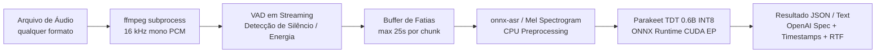

# Parakeet TDT 0.6B v3 pt-BR (ONNX INT8) — TAGARELA

Servidor de Speech-to-Text (STT) de alta performance e produção para **Português Brasileiro (pt-BR)** baseado no modelo **NVIDIA Parakeet TDT 0.6B v3**, quantizado em **ONNX INT8** pela iniciativa [TAGARELA](https://huggingface.co/calneymgp/parakeet-tdt-0.6b-v3-ptBR-TAGARELA-onnx-int8).

---

## Destaques do Projeto

- **Ultraleve e Rápido**: Executa com **ONNX Runtime (CUDA Execution Provider)** sem dependências pesadas de PyTorch ou NeMo em tempo de inferência.
- **Pegada de VRAM Reduzida**: Ocupa apenas **~2 a 4 GB de VRAM**, deixando mais de 20 GB livres em placas como RTX 3090 / 4090 / A5000 para outros modelos (LLMs, TTS, etc.).
- **Streaming VAD (Voice Activity Detection)**: Decodificação contínua via `ffmpeg` fatiada dinamicamente por energia acústica. Processa áudios de qualquer formato e de **duração ilimitada sem estourar RAM ou VRAM**.
- **Compatível com OpenAI API**: Endpoint compatível com `/v1/audio/transcriptions`, permitindo integração direta com bibliotecas existentes e com o SDK oficial da OpenAI.
- **Air-Gap / Self-Contained**: O modelo ONNX INT8 é baixado e congelado dentro da imagem Docker na etapa de build, garantindo inicialização confiável e sem dependência externa em runtime.

---

## Arquitetura de Execução



### Por que esta combinação técnica?

| Escolha | Motivo técnico |
| :--- | :--- |
| **ONNX INT8 + `onnxruntime-gpu` (CUDA EP)** | Menor uso de VRAM e maior throughput; elimina overhead de PyTorch e NeMo em produção. |
| **`cpu_preprocessing=True`** | Extração de mel spectrogram (`nemo128.onnx`) no CPU, reservando a GPU estritamente para o encoder acústico e decodificador TDT. |
| **`gpu_mem_limit` 4 GB** | O modelo 0.6B INT8 não necessita de mais que 4 GB; evita que o ORT aloje toda a VRAM da placa. |
| **`ffmpeg` → PCM 16 kHz mono pipe** | Suporta qualquer container/codec: MP3, MP4, M4A, AAC, OGG, OPUS, FLAC, WEBM, MKV, WAV, etc. |
| **VAD em streaming** | Duração de áudio ilimitada; o uso de RAM é proporcional a 1 chunk (~25s) e não ao tamanho total do arquivo. |
| **1 worker Uvicorn + Semaphore Lock** | A sessão ORT/CUDA não é segura para múltiplos processos bifurcados (fork-unsafe). Como a inferência ocorre a dezenas de vezes a velocidade de tempo-real, a fila em semáforo serializa requisições sem contenção de contexto CUDA. |

---

## Estrutura do Repositório

```
parakeet-tdt-0.6b-v3-ptBR-tagarela-onnx-int8/
├── Dockerfile             # Imagem de produção CUDA 12.4.1 com modelo embutido
├── compose.yaml           # Orquestração Docker Compose com reservas de GPU e tmpfs
├── requirements.txt       # Dependências Python (onnx-asr, onnxruntime-gpu, FastAPI)
├── app.py                 # Servidor FastAPI com VAD streaming e motor ASR
├── .dockerignore          # Filtro de contexto para build do Docker
├── .gitignore             # Arquivos e pastas ignorados pelo Git
├── .env.example           # Modelo de variáveis de ambiente configuráveis
├── download_model.py      # Script utilitário para download local do modelo
├── client_example.py      # Cliente CLI de teste (Python padrão sem dependências)
└── README.md              # Documentação completa do projeto
```

---

## Requisitos do Host

- **Driver NVIDIA**: Versão recente (≥ 550 recomendado).
- **NVIDIA Container Toolkit**: [Guia de Instalação Oficial](https://docs.nvidia.com/datacenter/cloud-native/container-toolkit/install-guide.html).
- **Docker** e **Docker Compose**.

---

## Inicialização Rápida com Docker Compose

### 1. Construir e Iniciar o Contêiner

```bash
docker compose up -d --build
```

O download do modelo (~1.4 GB) ocorre durante o build da imagem Docker.

### 2. Verificar Prontidão

```bash
# Liveness
curl -s http://localhost:8080/health

# Readiness (confirma se o modelo foi carregado e os providers disponíveis)
curl -s http://localhost:8080/ready
```

Resposta esperada:
```json
{"status":"ready","providers":["CUDAExecutionProvider","CPUExecutionProvider"]}
```

---

## Exemplos de Uso da API

### Usando cURL

#### Formato Detalhado (`verbose_json`) com Timestamps e Real-Time Factor (RTF):

```bash
curl -sS -X POST http://localhost:8080/v1/audio/transcriptions \
  -F file=@audio_exemplo.m4a \
  -F response_format=verbose_json
```

Exemplo de resposta:
```json
{
  "text": "olá tudo bem este é um teste de transcrição em português com parakeet",
  "language": "pt-BR",
  "duration": 4.52,
  "processing_time": 0.12,
  "realtime_factor": 0.0265,
  "segments": [
    {
      "id": 0,
      "start": 0.0,
      "end": 4.52,
      "text": "olá tudo bem este é um teste de transcrição em português com parakeet"
    }
  ],
  "model": "parakeet-tdt-0.6b-v3-ptBR-TAGARELA-onnx-int8"
}
```

#### Formato Simples (`json`):

```bash
curl -sS -X POST http://localhost:8080/v1/audio/transcriptions \
  -F file=@audio_exemplo.mp3 \
  -F response_format=json
```

Resposta:
```json
{
  "text": "olá tudo bem este é um teste de transcrição em português com parakeet",
  "duration": 4.52
}
```

#### Formato Texto Puro (`text`):

```bash
curl -sS -X POST http://localhost:8080/v1/audio/transcriptions \
  -F file=@audio_exemplo.wav \
  -F response_format=text
```

---

### Usando o Script Cliente Incluso (`client_example.py`)

O repositório inclui um cliente CLI pronto para uso, implementado apenas com a biblioteca padrão do Python (`urllib`):

```bash
python3 client_example.py caminho/para/audio.mp3 --format verbose_json
```

---

### Usando o SDK Oficial da OpenAI (Python)

Como o endpoint implementa o contrato `/v1/audio/transcriptions`, você pode utilizá-lo como substituto direto do Whisper no SDK oficial:

```python
from openai import OpenAI

client = OpenAI(
    base_url="http://localhost:8080/v1",
    api_key="nao-necessaria",
)

with open("audio.m4a", "rb") as audio_file:
    transcription = client.audio.transcriptions.create(
        model="parakeet-tdt-0.6b-v3-ptBR",
        file=audio_file,
        response_format="verbose_json",
    )

print("Texto transcrito:", transcription.text)
```

---

## Endpoints Disponíveis

| Método | Endpoint | Descrição |
| :--- | :--- | :--- |
| `POST` | `/v1/audio/transcriptions` | Endpoint principal de transcrição (compatível OpenAI). |
| `POST` | `/transcribe` | Alias conveniente para transcrição. |
| `GET` | `/health` | Checagem de integridade (liveness probe). |
| `GET` | `/ready` | Checagem de disponibilidade do modelo e providers ORT. |
| `GET` | `/v1/models` | Lista de modelos disponíveis (compatível OpenAI). |

---

## Variáveis de Ambiente

As seguintes variáveis podem ser configuradas no arquivo `.env` ou diretamente no `compose.yaml`:

| Variável | Padrão | Descrição |
| :--- | :--- | :--- |
| `MODEL_DIR` | `/opt/models/parakeet` | Diretório onde os artefatos do modelo ONNX residem. |
| `MODEL_ARCH` | `nemo-parakeet-tdt-0.6b-v3` | Identificador de arquitetura para o `onnx-asr`. |
| `QUANTIZATION` | `int8` | Tipo de quantização (`int8`, `fp16`, etc.). |
| `LANGUAGE` | `pt-BR` | Código de idioma retornado nos metadados. |
| `GPU_ID` | `0` | Índice do dispositivo CUDA utilizado pelo ORT. |
| `GPU_MEM_LIMIT_GB` | `4` | Limite de VRAM alocado para o pool de memória da GPU (em GB). |
| `MAX_CHUNK_S` | `25` | Tamanho máximo em segundos de um segmento antes de corte por silêncio. |
| `MIN_CHUNK_S` | `0.25` | Tamanho mínimo em segundos para considerar uma fala válida. |
| `MAX_CONCURRENT` | `1` | Número máximo de inferências simultâneas na GPU. |
| `ORT_INTRA_THREADS`| `4` | Número de threads para paralelismo intra-operação do ONNX Runtime. |
| `ORT_INTER_THREADS`| `2` | Número de threads para paralelismo inter-operação do ONNX Runtime. |
| `UPLOAD_DIR` | `/tmp/stt` | Diretório para escrita temporária dos arquivos recebidos (`tmpfs`). |
| `LOG_LEVEL` | `INFO` | Nível de log (`DEBUG`, `INFO`, `WARNING`, `ERROR`). |

---

## Dicas de Desempenho e Ajustes

- **Para máxima taxa de transferência (throughput)**: Mantenha `GPU_MEM_LIMIT_GB=4` e `MAX_CHUNK_S=25`.
- **Para menor latência por segmento**: Se o caso de uso exigir resposta rápida para áudios longos contínuos, reduza `MAX_CHUNK_S=20` ou `15`.
- **TensorRT**: Não é recomendado utilizar o TensorRT Execution Provider para este modelo INT8 pré-quantizado, pois sem cache de calibração explícito pode ocorrer degradação de desempenho ou falhas de build de engine. O `CUDAExecutionProvider` do ONNX Runtime oferece estabilidade e velocidade otimizadas.

---

## Execução Local fora do Docker (Opcional)

Caso prefira rodar diretamente no host Linux com ambiente virtual Python:

1. **Instale as dependências do sistema**:
   ```bash
   sudo apt-get update && sudo apt-get install -y ffmpeg
   ```

2. **Crie o ambiente virtual e instale os pacotes**:
   ```bash
   python3 -m venv .venv
   source .venv/bin/activate
   pip install -r requirements.txt
   pip uninstall -y onnxruntime || true
   pip install --force-reinstall --no-deps "onnxruntime-gpu>=1.20.0,<1.23.0"
   ```

3. **Baixe o modelo**:
   ```bash
   python3 download_model.py --dest ./models/parakeet
   ```

4. **Inicie o servidor**:
   ```bash
   export MODEL_DIR="./models/parakeet"
   uvicorn app:app --host 0.0.0.0 --port 8080
   ```

---

## Créditos e Reconhecimentos

- Modelo desenvolvido e treinado pela [NVIDIA NeMo (Parakeet TDT 0.6B)](https://huggingface.co/nvidia/parakeet-tdt-0.6b-v3).
- Fine-tuning e quantização INT8 para Português Brasileiro pelo projeto [TAGARELA / Calney G. P. Silva](https://huggingface.co/calneymgp/parakeet-tdt-0.6b-v3-ptBR-TAGARELA-onnx-int8).
- Motor de inferência leve por [onnx-asr](https://github.com/thewh1teagle/onnx-asr) e [ONNX Runtime](https://onnxruntime.ai/).
